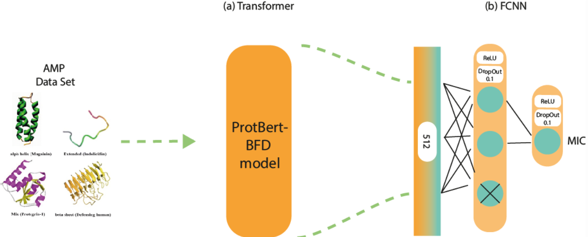

# Predicting the Inhibitory Capacity of Antimicrobial Peptides Against E. coli

## Descrição
In this study, we propose an innovative approach to predict the inhibitory capacity of peptides against bacteria, specifically targeting the minimal inhibitory concentration (MIC). Building upon existing research, we introduce novel methodologies to enhance prediction accuracy and effectiveness. The rise of antibiotic-resistant bacteria underscores the critical need for alternative treatment strategies. Antimicrobial peptides (AMPs) have emerged as a promising solution due to their broad-spectrum antibacterial properties. However, accurately predicting bacterial sensitivity to these peptides remains a formidable challenge.

This work addresses this challenge by leveraging the ProtBert-BFD model, a transformer-based approach pretrained on a large corpus of protein sequences in a self-supervised manner. Unlike the original BERT model, ProtBert-BFD processes protein sequences as separate documents, forgoing the next sentence prediction task. Instead, it randomly masks 15% of the amino acids in the input, allowing it to utilize vast amounts of publicly available data without human labeling.

We use the ProtBert-BFD model to analyze sequences of peptides and predict their inhibitory capacity against *Escherichia coli*, utilizing a dataset of minimal inhibitory concentration (MIC) and the logarithmic measure pMIC. The predictions from ProtBert-BFD are then processed through a fully connected neural network (FCNN) to enhance prediction accuracy.

Our approach begins with the pretraining of ProtBert-BFD on peptide sequences. The learned representations are then transferred to the prediction models, which output the MIC value - a key indicator of a peptide’s potency in inhibiting bacterial growth. The results demonstrate the efficacy of leveraging deep representations extracted from peptide sequences to predict MIC values. These findings highlight the methodology’s potential in advancing antimicrobial peptide prediction and personalized medicine in the fight against bacterial infections.

**Keywords**: ProtBert-BFD · Transformers · Fully Connected Neural Networks · Antimicrobial Peptides · MIC · *Escherichia coli*

## Instalação

### Pré-requisitos

- Python 3.10.0
- Pandas
- Transformers
- Torch
- Scikit-learn
- Matplotlib
- Seaborn
